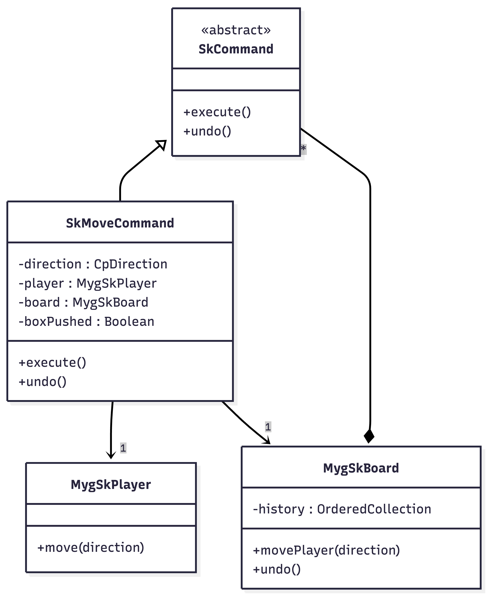

# Projet Sokoban - Évolutions

## Objectif Principal : Fonction "Undo" (Annuler)

L'objectif est de permettre au joueur de revenir en arrière coup par coup pour corriger ses erreurs sans avoir à recommencer tout le niveau.

### Roadmap

1.  **Phase 1 : Interface Graphique (UI)**
    *   Affichage d'un bouton "Annuler" visible dans l'interface du jeu.
    *   Ce bouton ne fera rien pour l'instant, il s'agit juste de la mise en place visuelle.

2.  **Phase 2 : Logique (Modèle)**
    *   Implémentation du **Pattern Command** pour encapsuler les mouvements.
    *   Création d'une pile d'historique pour stocker les actions passées.
    *   Gestion de l'annulation des déplacements simples et des poussées de caisses.

3.  **Phase 3 : Connexion**
    *   Relier le bouton "Annuler" à la logique d'annulation.
    *   Ajout éventuel d'un raccourci clavier.

## 4. Réalisation et Choix Techniques

Pour implémenter cette fonctionnalité, j'ai choisi d'adopter une approche **TDD (Test Driven Development)** et d'utiliser le **Pattern Command**.

### Approche TDD

Avant de coder la logique, j'ai d'abord écrit les tests unitaires correspondant aux fonctionnalités attendues. Comme nous l'avons vu pendant le cours sur le TDD, j'ai structuré mes tests en suivant le modèle **Context / Trigger / Assert**. Cela m'a permis de définir clairement le comportement de mon système avant de me lancer dans l'implémentation.

J'ai créé la classe `MygSkUndoTest` avec les scénarios suivants :
*   `testUndoSimpleMove` : Je vérifie que le joueur revient à sa position initiale après un déplacement simple et une annulation.
*   `testUndoBoxPush` : Je vérifie que le joueur ET la caisse reviennent à leurs positions initiales après une poussée et une annulation.
*   `testUndoEmptyHistory` : Je m'assure que l'annulation est sans effet (et sans crash) si l'historique est vide.
*   `testMultipleUndos` : Je vérifie la possibilité d'annuler plusieurs coups successifs.
*   `testResetClearsHistory` : Je vérifie que le redémarrage du niveau vide bien l'historique.

J'ai également ajouté un test UI `MygSkBoardElementTest >> testUndoButtonDisplayed` pour garantir la présence du bouton.

### Pattern Command

Pour gérer l'historique et l'annulation, j'ai mis en place le **Design Pattern Command**. Ce pattern me permet d'encapsuler une requête (ici un déplacement) sous forme d'objet.

Voici le diagramme UML de ma solution :

### Détails de l'implémentation

1.  **`SkCommand`** : C'est ma classe abstraite définissant l'interface commune (`execute`, `undo`).
2.  **`SkMoveCommand`** : C'est la commande concrète pour le déplacement.
    *   **Execute** : Je déplace le joueur et je mémorise si une caisse a été poussée (`boxPushed`).
    *   **Undo** : Je calcule la direction opposée. Je déplace le joueur en arrière. Si `boxPushed` est vrai, je déplace également la caisse adjacente en arrière.
3.  **`MygSkBoard`** : Il agit comme l'invocateur.
    *   Il possède une collection `history`.
    *   La méthode `movePlayer:` crée une `SkMoveCommand`, l'exécute, et l'ajoute à l'historique si le mouvement a réussi.
    *   La méthode `undo` dépile la dernière commande et appelle sa méthode `undo`.

### Intégration Interface (UI)

J'ai ensuite connecté l'interface graphique `MygSkBoardElement` au nouveau modèle :
*   Le bouton "Annuler" déclenche `board undo` puis rafraîchit l'affichage (`refreshBoard`).
*   Les événements clavier appellent désormais `board movePlayer:` au lieu de manipuler directement le joueur, assurant que toutes les actions passent par le système de commandes.
